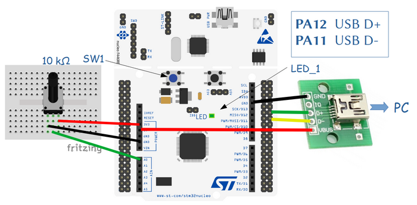

# USB generic HID PnP demo
## project name: mbed6_usbHID_PnP
Tested by: **Keil Studio** 1.50 and **Mbed-OS** 6.16.0

This program implements a general USB HID device, from which the value of the voltage measured 
at the analog input A0 and the status of the user push button can be queried from the PC. 
By sending a specific command, we can control the state of the built-in LED1.
We are sending and receiving packages of 64 bytes. 
In the case of the packages received from the PC only the first byte has meaning.
The package sent as answer are reports, whic consist of one or more bytes.

| Commans | Answer | Description                                    |
|:-------:|:------:|:-----------------------------------------------|
| 0x80| none | Toggle LED1 state (no answer is sent)                |
| 0x81| 0x81 1 or 0| Query BUTTON1 state 1: pressed, 0: not őressed |
| 0x37| 0x37 LSB MSB| Query voltage measured at the ADC A0 input    |
| other| 0xFF| Unknown command                                      |

The **USBHID** class provides generic HID (Human Interface Device) functionality over the USB channel. 
In the case of generic HID devices, the HID report descriptor specifies 
only specifies the amount of data transferred. The interpretation of the data, however, is left to the firmware 
loaded into the microcontroller and the application running on the PC. In this case, only the method 
of transmission is standard, but the use of the data is unique and manufacturer-specific.
This means, that we need an application on our computer that can manage and understand the USBHID 
data traffic of the unique device we created. It can even be a script, for which we can use the **pywinusb ** 
extension of the Python interpreter. Another option is the [hidapi library](https://github.com/libusb/hidapi), 
which can be used from C/C++ console applications or graphical applications.

Due to laziness, we did not write a new PC application, instead we "borrowed" the USB HID PnP demo sample application from the 
[Microchip Library for Applications (MLA)](https://www.microchip.com/en-us/tools-resources/develop/libraries/microchip-libraries-for-applications) 
and adopted it (Vid/Pid exchange, ProgressBar1 maximum 4096 instead of 1024).
For your convenience a precompiled .exe (HID PnP Demo.exe) is includued also in this project package. It runs in Windows.


## Hardware requirements
* NUCLEO-F446RE development board
* One 10 k potentiometer which divides the 3,3 V power voltage. The slider is connected to A0 (PA_0) analog input.
* USB connector breakout for the STM32F446RE USBFS channel
* USB connection to a PC through the built-in ST-Link v2-1

## Wiring instructions for the NUCLEO-F446RE board

There is no USB connector for the USBFS channel of the target CPU therefore we have to prepare connection
by using an USB cable and an USB socket breakout card.

| USB breakout  | NUCLEO-F446RE pin   |
|:-------:|:-----: |
|  GND    |GND     | 
|  ID     | --     | 
|  D+     | PA_12  |
|  D-     | PA_11  | 
|  VBUS   | 5V     | 





## Software requirements
* Start with an empty mbed 6 project
* Edit the main.cpp source file
* Configure the project by adding an **mbed_app.json** file in which
    * We have to configure **usb_speed** parameter
    * We have to add **USBDEVICE** to the device list of the target

Finally the **mbed_app.json** sholuld look like this: 

```
{
    "config": {
        "usb_speed": {
            "help": "USE_USB_OTG_FS or USE_USB_OTG_HS or USE_USB_HS_IN_FS",
            "value": "USE_USB_OTG_FS"
        }
    },
    "target_overrides": {
        "*": {
            "target.device_has_add": ["USBDEVICE"]
        }
    }
}
```
## mbed6_usbHID_PnP results
Start the **HID PnP Demo.exe** application on the PC then connect the MCU card
(both the ST-Link and the target USB should be connected).
After successful connection the atacched state of the device should be TRUE.
Then the builtin LED (LED1) can be switched on and off by clicking the pushbutton.
The state of the builtin pushbutton (BUTTON1) as well as the measured voltage 
will be monitored continuously.


### Using with Python script

Another possibility for testing is the usage of a Python script (besides Python we have to install the **pywinusb** helper module as well)
The following Python script is a console application which provides a menu for controlling the USB communication with the mbed card.

```python
from time import sleep
from msvcrt import kbhit

import pywinusb.hid as hid

def sample_handler(data):
    print("Raw data: {0}".format(data))
    if data[1] == 0x81:
       if data[2] == 0:
          print("Button is pressed")
       else:
          print("Button is not pressed")
    elif data[1] == 0x37:
       adc = data[3]*256 + data[2]
       voltage = int(adc*3300/4096)
       print("ADC = {0} = {1} mV".format(adc,voltage))   

def send_command(cmd):    # Send the message to the Mbed board
    # The first byte is the report ID which must be 0
    buffer = [0 for i in range(65)]  # Array of 65 elements  
    buffer[1] = cmd
    #-- print(len(buffer),": ", buffer)
    out_report = device.find_output_reports()
    out_report[0].set_raw_data(buffer)
    out_report[0].send()  

all_devices = hid.HidDeviceFilter(vendor_id = 0x0483, product_id = 0x5750).get_devices()

if not all_devices:
    raise ValueError("HID device not found")

device = all_devices[0]
print("Device connected!\r\nSelect option:")
print("0. Exit")
print("1. Toggle LED state")
print("2. Read Button state")
print("3. Read ADC value")

device.open()
# Set custom raw data handler
device.set_raw_data_handler(sample_handler)
while device.is_plugged():
    print("\nCommand ('0' to '3') [press Enter after number]: ")
    while not kbhit() and device.is_plugged():
        index_option = input()
        if index_option.isdigit() and int(index_option) < 4:
            break;
    ix = int(index_option)

    if ix == 0:
        device.close()
        exit()
        pass
    elif ix == 1:
        send_command(0x80)
        pass
    elif ix == 2:
        send_command(0x81)
        pass
    elif ix == 3:
        send_command(0x37)
        pass
```


